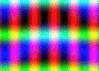
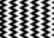
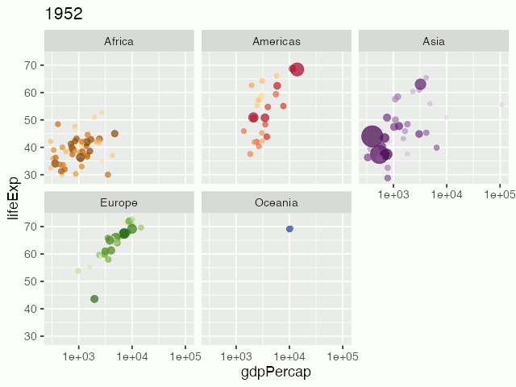

<!-- README.md is generated from README.Rmd. Please edit that file -->

# mp4encoder

<!-- badges: start -->


[](https://CRAN.R-project.org/package=mp4encoder)
[](https://github.com/coolbutuseless/mp4encoder/actions/workflows/R-CMD-check.yaml)
<!-- badges: end -->

`{mp4encoder}` is an mp4 encoder for R which can encode RGB arrays and
native rasters to H264 video in an mp4 container. These video files are
playable on nearly all platforms and web browsers.

This package is different from other video encoders (such as
[`{av}`](https://cran.r-project.org/package=av)) in that:

- it does not rely on `ffmpeg` or other encoding libraries to generate
  the file
- it only requires two (mainly) base R packages for orchestrating the
  byte- and bit- manipulation required to correctly write the file i.e. 
  [`{ctypesio}`](https://cran.r-project.org/package=ctypesio) and
  [`{bitstreamio}`](https://cran.r-project.org/package=bitstreamio)
- the `h264` encoding and muxing into an `mp4` file is done using R
- it is reasonably fast as it uses a specific H264 option to encode
  *uncompressed* images as the frames of the video.

### Speed

On an M3 Mac, images with size 800x600 can be written to an `mp4` file
at around **750 frames/second**.

### What’s in the box

- `mp4_open()`, `mp4_write()`, `mp4_close()`
  - Write H264 encoded video stream in an mp4 container.
  - This is the option 99.9% of users will want

For experts who want a raw h264 Annex B stream:

- `h264_open()`, `h264_write()`, `h264_close()`
  - For writing an Annex B H264 Stream
  - This result is not playable out-of-the-box on most systems.
  - I.e. you will probably have to mux the stream into a container in
    order to play it back.

Accepted image types

- Numeric RGB arrays with all values in range \[0, 1\] (no NAs allowed)
- Native raster objects
- Images must have dimensions which are multiples of 16
  - Use `pad_array()` to resize arrays

## Installation

<!-- This package can be installed from CRAN -->

<!-- ``` r -->

<!-- install.packages('mp4encoder') -->

<!-- ``` -->

You can install the latest development version from
[GitHub](https://github.com/coolbutuseless/mp4encoder) with:

``` r
# install.package('remotes')
remotes::install_github('coolbutuseless/mp4encoder')
```

<!-- Pre-built source/binary versions can also be installed from -->

<!-- [R-universe](https://r-universe.dev) -->

<!-- ``` r -->

<!-- install.packages('mp4encoder', repos = c('https://coolbutuseless.r-universe.dev', 'https://cloud.r-project.org')) -->

<!-- ``` -->

## Example with RGB array

``` r
library(mp4encoder)

#~~~~~~~~~~~~~~~~~~~~~~~~~~~~~~~~~~~~~~~~~~~~~~~~~~~~~~~~~~~~~~~~~~~~~~~~~~~~
# The array dimensions must be multiple of 16
# Use `pad_array()` if your array isn't of the correct size, but for 
# best performance create the array with a correct size from the start
#~~~~~~~~~~~~~~~~~~~~~~~~~~~~~~~~~~~~~~~~~~~~~~~~~~~~~~~~~~~~~~~~~~~~~~~~~~~~
w <- 112  # 7 * 16
h <-  80  # 5 * 16

#~~~~~~~~~~~~~~~~~~~~~~~~~~~~~~~~~~~~~~~~~~~~~~~~~~~~~~~~~~~~~~~~~~~~~~~~~~~~
# Create a Video Coding context
#~~~~~~~~~~~~~~~~~~~~~~~~~~~~~~~~~~~~~~~~~~~~~~~~~~~~~~~~~~~~~~~~~~~~~~~~~~~~
vc <- mp4_open("man/figures/test-array.mp4")

coords <- expand.grid(y = seq(h)/h * 2 * pi - pi, x = seq(w)/w * 2 * pi - pi)

#~~~~~~~~~~~~~~~~~~~~~~~~~~~~~~~~~~~~~~~~~~~~~~~~~~~~~~~~~~~~~~~~~~~~~~~~~~~~
# as each frame is created, write it to the mp4
#~~~~~~~~~~~~~~~~~~~~~~~~~~~~~~~~~~~~~~~~~~~~~~~~~~~~~~~~~~~~~~~~~~~~~~~~~~~~
for (angle in seq(0, 2*pi, length.out = 30))  {
  
  # Create an array 
  arr <- array(0, dim = c(h, w, 3))
  arr[,,1] <- 0.5 * (sin(5 * coords$x + 1 * angle) + 1)
  arr[,,2] <- 0.5 * (cos(3 * sin(coords$y) + 2 * angle) + 1)
  arr[,,3] <- 0.5 * (sin(1.5 * coords$y + cos(coords$x) + 3 * angle) + 1)
  
  # Write the array into the mp4
  mp4_write(vc, arr)
}

mp4_close(vc)
```



## Writing a matrix as an mp4

Matrix will be treated as a monochrome image

``` r
library(mp4encoder)

#~~~~~~~~~~~~~~~~~~~~~~~~~~~~~~~~~~~~~~~~~~~~~~~~~~~~~~~~~~~~~~~~~~~~~~~~~~~~
# The array dimensions must be multiple of 16
# Use `pad_array()` if your array isn't of the correct size, but for 
# best performance create the array with a correct size from the start
#~~~~~~~~~~~~~~~~~~~~~~~~~~~~~~~~~~~~~~~~~~~~~~~~~~~~~~~~~~~~~~~~~~~~~~~~~~~~
w <- 112  # 7 * 16
h <-  80  # 5 * 16

#~~~~~~~~~~~~~~~~~~~~~~~~~~~~~~~~~~~~~~~~~~~~~~~~~~~~~~~~~~~~~~~~~~~~~~~~~~~~
# Create a Video Coding context
#~~~~~~~~~~~~~~~~~~~~~~~~~~~~~~~~~~~~~~~~~~~~~~~~~~~~~~~~~~~~~~~~~~~~~~~~~~~~
vc <- mp4_open("man/figures/test-matrix.mp4")

#~~~~~~~~~~~~~~~~~~~~~~~~~~~~~~~~~~~~~~~~~~~~~~~~~~~~~~~~~~~~~~~~~~~~~~~~~~~~
# coordinates at which calculation happens
#~~~~~~~~~~~~~~~~~~~~~~~~~~~~~~~~~~~~~~~~~~~~~~~~~~~~~~~~~~~~~~~~~~~~~~~~~~~~
coords <- expand.grid(y = seq(h)/h * 2 * pi - pi, x = seq(w)/w * 2 * pi - pi)

#~~~~~~~~~~~~~~~~~~~~~~~~~~~~~~~~~~~~~~~~~~~~~~~~~~~~~~~~~~~~~~~~~~~~~~~~~~~~
# as each frame is created, write it to the mp4
#~~~~~~~~~~~~~~~~~~~~~~~~~~~~~~~~~~~~~~~~~~~~~~~~~~~~~~~~~~~~~~~~~~~~~~~~~~~~
for (angle in seq(0, 2*pi, length.out = 30))  {
  
  # Create an array 
  mat <- matrix(0, h, w)
  mat[] <- 0.5 * (sin(5 * coords$x + cos(coords$y * 7)  + 2 * angle) + 1)

  mp4_write(vc, mat)
}

mp4_close(vc)
```



## Example with `{nara}`

``` r
library(png)
library(nara)
library(mp4encoder)

#~~~~~~~~~~~~~~~~~~~~~~~~~~~~~~~~~~~~~~~~~~~~~~~~~~~~~~~~~~~~~~~~~~~~~~~~~~~~
# Read the old style R logo from the PNG package
#~~~~~~~~~~~~~~~~~~~~~~~~~~~~~~~~~~~~~~~~~~~~~~~~~~~~~~~~~~~~~~~~~~~~~~~~~~~~
logo <- readPNG(system.file("img", "Rlogo.png", package="png"), native = TRUE)

#~~~~~~~~~~~~~~~~~~~~~~~~~~~~~~~~~~~~~~~~~~~~~~~~~~~~~~~~~~~~~~~~~~~~~~~~~~~~
# Open an mp4 and keep track of the video context (VC)
#~~~~~~~~~~~~~~~~~~~~~~~~~~~~~~~~~~~~~~~~~~~~~~~~~~~~~~~~~~~~~~~~~~~~~~~~~~~~
vc <- mp4_open("man/figures/test-nara.mp4", fps = 30)

#~~~~~~~~~~~~~~~~~~~~~~~~~~~~~~~~~~~~~~~~~~~~~~~~~~~~~~~~~~~~~~~~~~~~~~~~~~~~
# The array dimensions must be multiple of 16
# Use `pad_array()` if your array isn't of the correct size, but for 
# best performance create the array with a correct size from the start
#~~~~~~~~~~~~~~~~~~~~~~~~~~~~~~~~~~~~~~~~~~~~~~~~~~~~~~~~~~~~~~~~~~~~~~~~~~~~
w <- (8 * 16) 
h <- (6 * 16) 

#~~~~~~~~~~~~~~~~~~~~~~~~~~~~~~~~~~~~~~~~~~~~~~~~~~~~~~~~~~~~~~~~~~~~~~~~~~~~
# create a native raster for assembling the image
#~~~~~~~~~~~~~~~~~~~~~~~~~~~~~~~~~~~~~~~~~~~~~~~~~~~~~~~~~~~~~~~~~~~~~~~~~~~~
nr <- nr_new(w, h, 'grey80')


for (angle in seq(0, 2*pi, length.out = 30))  {
  nr_fill(nr, 'grey80')
  nr_blit(nr, logo, x = w/2, y = h/2, scale = 0.8, hjust = 0.5, vjust = 0.5, angle = angle)
  
  mp4_write(vc, nr)
}

mp4_close(vc)
```


## Example saving `{ggplot2}` animations using `{ragg}`

The [`{ragg}`](https://cran.r-project.org/package=ragg) graphics device
can be used to capture plots as native rasters (or arrays).

`{mp4encoder}` is purely a mp4 writer, so it does not do any automatic
interpolation like
[`{gganimate}`](https://cran.r-project.org/package=gganimate) does.

``` r
library(ggplot2)
library(ragg)
library(gapminder)

library(mp4encoder)

#~~~~~~~~~~~~~~~~~~~~~~~~~~~~~~~~~~~~~~~~~~~~~~~~~~~~~~~~~~~~~~~~~~~~~~~~~~~~
# Open an mp4 and keep track of the video context (VC)
#~~~~~~~~~~~~~~~~~~~~~~~~~~~~~~~~~~~~~~~~~~~~~~~~~~~~~~~~~~~~~~~~~~~~~~~~~~~~
vc <- mp4_open("man/figures/test-ragg.mp4", fps = 2)

#~~~~~~~~~~~~~~~~~~~~~~~~~~~~~~~~~~~~~~~~~~~~~~~~~~~~~~~~~~~~~~~~~~~~~~~~~~~~
# For each year,
#   - filter the gapminder data for this year
#   - create a capture device using `ragg`
#   - create the plot
#   - get a native raster of the plot from the capture device
#   - write this image into the mp4
#~~~~~~~~~~~~~~~~~~~~~~~~~~~~~~~~~~~~~~~~~~~~~~~~~~~~~~~~~~~~~~~~~~~~~~~~~~~~
for (this_year in sort(unique(gapminder$year))) {

  # Subset data
  plot_df <- subset(gapminder, year == this_year)
  
  # Create a cpature device
  get_plot <- ragg::agg_capture(width = 640, height = 480)
  
  # Create the plot
  p <- ggplot(plot_df, aes(gdpPercap, lifeExp, size = pop, colour = country)) +
    geom_point(alpha = 0.7, show.legend = FALSE) +
    scale_colour_manual(values = country_colors) +
    scale_size(range = c(2, 12)) +
    scale_x_log10() +
    facet_wrap(~continent) +
    labs(title = this_year) +
    theme_grey(base_size = 18)
  plot(p)
  
  # Fetch the current plot as a native raster
  nr <- get_plot(native = TRUE)
  
  # Write out the native raster image to the mp4
  mp4_write(vc, nr)
  dev.off()
}

#~~~~~~~~~~~~~~~~~~~~~~~~~~~~~~~~~~~~~~~~~~~~~~~~~~~~~~~~~~~~~~~~~~~~~~~~~~~~
# finalise the mp4 file
#~~~~~~~~~~~~~~~~~~~~~~~~~~~~~~~~~~~~~~~~~~~~~~~~~~~~~~~~~~~~~~~~~~~~~~~~~~~~
mp4_close(vc)
```



## Note

Because github won’t show mp4 video in a README, I’ve had to convert the
mp4s to gifs for display.

## References

- [World’s smallest h264
  encoder](https://www.cardinalpeak.com/blog/worlds-smallest-h-264-encoder)
  - A major take-away from this blog post is that it is possible to
    produce H264s *without* doing any compression!
  - This means that after color conversion (RGB to YCbCr) the raw pixel
    data is written to file without and compression or predictive
    coding.
- ISO 14496-10 Advanced Video Codec
- ISO 14496-12 ISO Base Media Format
- ISO 14496-14 MP4 File Format
- ISO 14496-15 AVC File Format

## Related Software

[{av} package](https://cran.r-project.org/package=av) on CRAN which
interfaces with [ffmpeg](ffmpeg.org)
